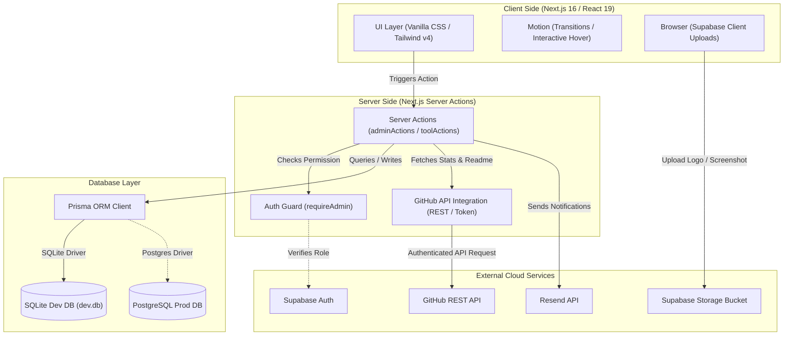
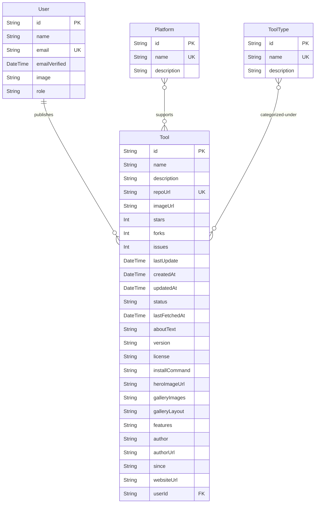

# AI Tool Research (aitoolresearch.com) - System Architecture & Design Specification

This specification outlines the technical design, architectural framework, custom database schema, design system, security protocols, and operational workflows of the AI Tool Research platform. It functions as the comprehensive source of truth for both developers and agentic workflows.

---

## 1. System Vision & Core Mission

**AI Tool Research (aitoolresearch.com)** is a premium, manually curated "Tool Dictionary" designed to discover, browse, and master top open-source AI tools hosted on GitHub. 

Unlike automatic scrapers that aggregate low-quality, low-signal noise, this platform enforces a strict **manual curation process** overseen by human editors. This premium methodology guarantees data accuracy, structural consistency, and premium aesthetics, making it a high-signal discovery platform for engineers, creators, and researchers.

---

## 2. Core Technology Stack

The application is architected around a modern full-stack web structure located inside the `tools-section` folder:

| Component | Technology | Description |
| :--- | :--- | :--- |
| **Framework** | Next.js 16.2 (App Router) + React 19.2 | Leverages React 19's server actions and component architecture. |
| **Styling** | Tailwind CSS v4 + Vanilla CSS | Uses Tailwind's new `@theme` system alongside custom glassmorphism components. |
| **Database ORM** | Prisma Client (v7.8) | Handles database queries and schema updates. |
| **Database** | SQLite (dev.db) / Supabase PostgreSQL | Local SQLite for development; Postgres in staging/production. |
| **Authentication** | Supabase Auth | Manages user credentials, authentication flows, and token validation. |
| **Storage** | Supabase Storage (`tool-screenshots` bucket) | Handles uploads of tool logos and gallery screenshots. |
| **Third-Party APIs** | GitHub REST API (via Octokit/Fetch) | Dynamic repository data fetching (stars, forks, readme, tags). |
| **Email** | Resend Client | Facilitates system notifications and administrative emails. |

---

## 3. Structural Directory Architecture

To ensure strict separation of concerns, the workspace is organized by feature and surface area rather than utility. Below is the directory map of the codebase:

```text
tools-section/
├── prisma/
│   ├── schema.prisma          # Prisma Schema Definition (SQLite)
│   └── migrations/            # Auto-generated SQL migrations
├── public/                    # Static assets and icons
├── src/
│   ├── app/
│   │   ├── actions/           # Server Actions separating business logic from components
│   │   │   ├── adminActions.ts # Administrative mutations (Create/Update tools)
│   │   │   └── toolActions.ts  # Visitor query actions
│   │   ├── admin/             # Admin portal pages and forms
│   │   ├── auth/              # Supabase authentication screens
│   │   ├── tool/              # Curated tool detail and dynamic review pages
│   │   ├── tools/             # Tool catalog pages with search & filters
│   │   ├── layout.tsx         # Global layouts, typography, & navigation headers
│   │   ├── globals.css        # Tailwind v4 @theme custom design tokens
│   │   └── page.tsx           # Premium landing page (aitoolresearch.com)
│   ├── components/            # Highly focused UI & admin components
│   │   ├── admin/             # ToolForm, CategoryManager, layout sidebars
│   │   └── ui/                # SearchBar, ToolCard, CategoryChip, buttons
│   └── lib/                   # Integrations and backend shared libraries
│       ├── auth-guard.ts      # requireAdmin middleware guards
│       ├── github.ts          # Octokit & REST GitHub connection utilities
│       ├── prisma.ts          # Centralized PrismaClient instance exporter
│       └── supabase.ts        # Supabase storage upload & client configurations
└── package.json               # Package dependencies & development scripts
```

---

## 4. System Architecture Diagram

The system coordinates direct browser uploads, server-side data fetching from third-party networks, permission guards, and local/production databases seamlessly:



---

## 5. Database Schema & Data Modeling

The Prisma schema leverages SQLite in development. Relationships are optimized to connect tools with system users, platform targets, and distinct taxonomical categories (tool types):



### Key Models Defined in Prisma Schema:
- **`User`**: Admin & Editor accounts. Roles include `USER` and `ADMIN`.
- **`Platform`**: OS targets for tools (e.g. `Windows`, `macOS`, `Linux`, `Android`, `Docker`).
- **`ToolType`**: Categories classifying tools (e.g. `MCP Servers`, `AI Tools`, `Developer Tools`).
- **`Tool`**: The core data container representing a curated open-source repository. Stores real-time metadata (stars, forks, open issues), design variables (gallery images JSON, aspect layout, custom 3-features JSON), installation strings (structured commands mapped by OS), and markdown documentation (`aboutText`).

---

## 6. Design System & Visual Aesthetics

AI Tool Research enforces a high-quality, luxury design direction, avoiding generic "clean minimal" or unmodified templates.

> This section governs the **look**. For the **words** — brand voice, editorial conventions for tool
> write-ups, messaging, and positioning — see [`BRAND.md`](BRAND.md). `DESIGN.md` stays authoritative
> for anything visual; `BRAND.md` owns voice and copy.

### A. Color System (Tailwind CSS v4 `@theme` Mappings)
We use a disciplined, dark luxury palette heavily inspired by **Material Design v3** tokens:

*   **Primary Colors**: `--color-primary` (`#c3c0ff`) | `--color-on-primary` (`#1d00a5`) | `--color-primary-container` (`#4f46e5`)
*   **Secondary Colors**: `--color-secondary` (`#89ceff`) | `--color-on-secondary` (`#00344d`)
*   **Tertiary Colors**: `--color-tertiary` (`#ffb695`) | `--color-on-tertiary` (`#571f00`)
*   **Luxury Surface Levels**: 
    *   `--color-surface` (`#131313`)
    *   `--color-surface-container-lowest` (`#0e0e0e`)
    *   `--color-surface-container-low` (`#1c1b1b`)
    *   `--color-surface-container` (`#201f1f`)
    *   `--color-surface-container-high` (`#2a2a2a`)
    *   `--color-background` (`#0A0A0A`)
*   **Outline System**: `--color-outline` (`#918fa1`) | `--color-outline-variant` (`#464555`)

### B. Core UI Elements & Layouts
1.  **Glass Panels (`.glass-panel`)**: Uses translucent dark background colors with high-precision backdrop blur alongside layered top-border highlights:
    ```css
    .glass-panel {
      background: rgba(18, 18, 18, 0.6);
      backdrop-filter: blur(20px);
      -webkit-backdrop-filter: blur(20px);
      border: 1px solid rgba(255, 255, 255, 0.05);
      border-top: 1px solid rgba(255, 255, 255, 0.1);
    }
    ```
2.  **Typography with Intent**: Focuses on professional sans-serif and code layout mappings:
    *   **Hero Headers (`--font-display-lg`)**: Bold, tracked tightly with negative letter-spacing (`-0.02em`), designed to wow visitors instantly.
    *   **Monospace Code (`--font-code-snippet`)**: Custom monospace mapping for system execution strings.
3.  **Compositor-Friendly Motion**: Custom transition classes specifically animating composition-friendly variables (`transform`, `opacity`, `clip-path`) rather than layout-bound variables (`width`, `height`, `margin`) to prevent main-thread layout shifts.

> [!IMPORTANT]
> **Banned UI Patterns:** Banned elements include uniform radius, safe gray-on-white defaults, sidebar + card dashboards without editorial rhythm, and default card grids without scale hierarchy.
> **Required UI Qualities:** Premium sections must exhibit rich typography pairing, Semantic HTML5 layout tags (`<header>`, `<main>`, `<section>`), custom designed active/focus states, and dynamic light/dark mode custom colors.

---

## 7. Crucial Workflows & Pipeline Cycles

### A. The Curator Tool Submission Lifecycle

The system automates metadata aggregation upon manual entry to make curation fast and premium:

```text
[Curator enters GitHub URL] ──> [Server fetches repository details from GitHub API]
                                         │
                                         ├── Repos/Owner: fetch stars, forks, issues, license, homepage
                                         ├── Releases/Latest: fetch version tag
                                         └── Readme/Markdown: fetch raw README content
                                         │
                                 [Mapping logic connects platforms & tool types]
                                         │
                                 [Curator uploads Logo / Gallery images]
                                         │ (Saves direct to Supabase Storage Bucket)
                                         │
                                 [Curator writes installation commands & features]
                                         │
                                 [Curator publishes: DB record created / Page revalidated]
```

1.  **Metadata Fetching**: Done via the server-side action `fetchGitHubMetadata(repoUrl)`. Uses token authorization, and aggregates data from three GitHub endpoints sequentially:
    *   Repository endpoints: `https://api.github.com/repos/{owner}/{repo}`
    *   Releases endpoints: `https://api.github.com/repos/{owner}/{repo}/releases/latest`
    *   Readme endpoints: `https://api.github.com/repos/{owner}/{repo}/readme`
2.  **Image Uploading Pipeline**: Done through browser-side actions triggering `uploadToolImage(file, name)`. Image assets are loaded directly into the Supabase bucket named `tool-screenshots`. The public URL is saved as the image key in the Prisma DB.
3.  **OS-Specific Installation Command System**: Commands are stored in a serialized JSON structure containing custom script arrays mapped to specific operating systems (`macOS`, `Windows`, `Linux`, `Docker`, or `Universal`), letting curators supply specific shell strings for different targets.
4.  **Static Page Revalidation**: When a tool is published or modified, the cache-layer triggers `revalidatePath` for public directories (`/tools`, `/tools/{id}`, `/admin/tools`), immediately reflecting changes globally.

### B. Category Management & Delete Guards
Category groupings (`Platforms` and `ToolTypes`) are strictly managed:
*   **Active Linkage Verification**: The system implements an association guard. Before a platform or category is deleted, a Prisma check counts its linked tools.
*   **Validation**: If count > 0, the server action throws a database error: *"Cannot delete category because it is associated with tools."* This prevents data orphanages or missing taxonomy.

---

## 8. Security & Identity Framework

1.  **Administrator Identity Verification**: Admin routes and data-mutation Server Actions are secured behind `requireAdmin()`.
2.  **Dev Bypass Mechanism**:
    > [!NOTE]
    > In current developmental sandboxes, the admin check returns a mock administrator user (`temp-admin-id`) to bypass network authentication blockers, allowing rapid UI and layout compilation. 
3.  **SQL Injection Shielding**: Prisma ORM acts as the absolute barrier against query tampering by parameterizing all queries and managing migrations securely.

---

## 9. Performance & SEO Optimizations

1.  **Core Web Vitals**: Focuses on minimized JS bundles, fast font-family rendering, and absolute prevention of layout shifts by reserving container aspect-ratio spaces (e.g. `aspect-video` for screenshot loaders).
2.  **Canonical Sitemap Pipelines**: Builds static paths with metadata headers. Dynamic titles and metadata are rendered to improve search visibility, ensuring AI Tool Research rankings remain high across modern search networks.
